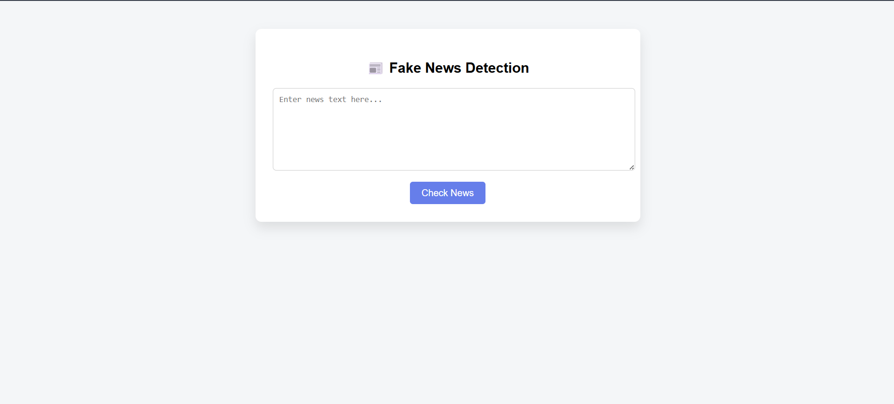
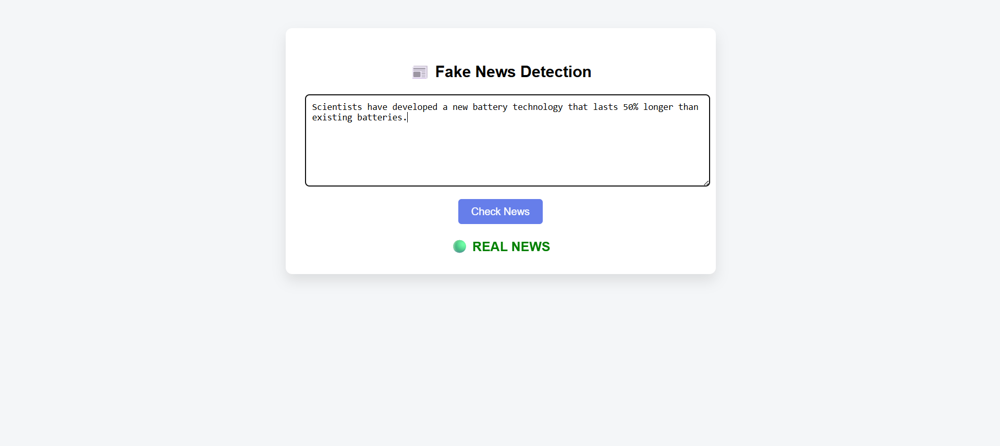

# Fake News Detection using NLP and Machine Learning

## Overview

Fake News Detection is a web-based application that uses Natural Language Processing (NLP) and Machine Learning to classify news articles as **Real News** or **Fake News**.

The system preprocesses news text, converts it into numerical features using TF-IDF Vectorization, and uses a trained machine learning model to make predictions through an easy-to-use Flask web interface.

---

## Features

* User authentication through login page
* News article classification
* NLP-based text preprocessing
* Machine Learning prediction engine
* Interactive Flask web interface
* Real-time prediction results

---

## Tech Stack

### Backend

* Python
* Flask

### Machine Learning

* Scikit-learn
* Pandas
* NumPy

### NLP

* NLTK
* TF-IDF Vectorization

### Frontend

* HTML
* CSS

---

## Screenshots

### Login Page


### News Detection Interface



### Prediction Result



---

## Project Structure

```text
fake-news-detection/

├── app.py
├── train.py
├── predict.py
├── requirements.txt
├── README.md

├── data/
├── model/
├── static/
└── templates/
```

---

## How It Works

1. User enters login information.
2. User is redirected to the detection page.
3. News article text is entered.
4. NLP preprocessing removes unnecessary words and symbols.
5. TF-IDF converts text into machine-readable features.
6. The trained machine learning model predicts whether the news is Real or Fake.
7. Prediction is displayed instantly.

---

## Installation

### Clone Repository

```bash
git clone https://github.com/aanya00/fake-news-detection.git
```

### Move Into Project Folder

```bash
cd fake-news-detection
```

### Install Dependencies

```bash
pip install -r requirements.txt
```

### Run Application

```bash
python app.py
```

### Open Browser

```text
http://127.0.0.1:5000
```

---

## Future Improvements

* Deep Learning based models
* BERT and Transformer integration
* Multi-language support
* News source credibility analysis
* Advanced visualization dashboard

---

## Author

**Aanya Agrawal**

B.Tech Computer Science (Artificial Intelligence)

GitHub: https://github.com/aanya00
